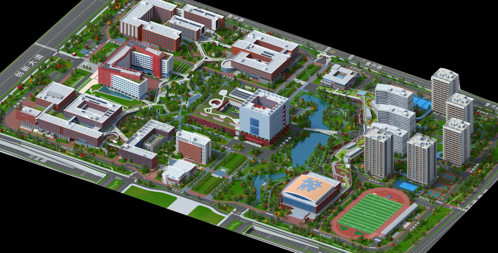

# 校园回忆录

🎓 在地图里重走校园，把照片、地点、建筑和人物整理成自己的毕业回忆录。 
目前先制作 **中国科学技术大学高新校区**，并逐步扩展中科大多个校区。

<a href="https://kw66.github.io/campus-memoir/"><strong>🎮 点击即玩</strong></a>
·
<a href="https://kw66.github.io/games/"><strong>👤 作者游戏合集</strong></a>

  

## 项目简介

《校园回忆录》是一款校园照片打卡与回忆整理游戏。玩家可以在校园地图上移动、建立拍照点、点亮建筑和场所，并逐步补全宿舍、实验室、食堂、体育馆、超市等校园记忆。

## 核心玩法

| 模块 | 内容 |
| --- | --- |
| 🗺️ 校园地图 | 在大地图中移动小人，缩放、拖动、跟随视角 |
| 📸 拍照点 | 到达某个位置后建立拍照点，添加多张照片，路过时优先显示最近照片 |
| 🧩 探索进度 | 通过建筑照片和拍照点点亮校园网格，点击探索条可查看探索区域 |
| 🏫 建筑回忆 | 给建筑命名、拍照、关联入口，进入后整理楼内场所 |
| 🛏️ 室内场所 | 建筑内部也是地图，可划分寝室、实验室、办公室、食堂窗口、球场等场所 |
| 👥 人物物品 | 在场所中添加人物、物品和照片，人物可记录关系与聊天回忆 |
| 🧭 地图编辑 | 裁剪底图、修补图片、绘制建筑/道路/水体/围墙等结构 |
| 📦 内置地图 | 可下载官方提供的校区整合包，也可以自行导入地图和结构 |
| 💾 游戏资料库 | 地图、结构、照片原图和游戏数据可同步到本机文件夹 |

## 玩法目标

| 阶段 | 内容 |
| --- | --- |
| 🎒 校园回忆录 | 面向毕业生和校友，整理照片、地点、建筑、同学和老师 |
| 🚶 校园进行时 | 面向新生和低年级学生，后续加入跑图任务和校园探索 |
| 🌏 多校区扩展 | 先做中科大校区，再支持更多学校地图 |

## 快速开始

| 操作 | 说明 |
| --- | --- |
| 进入游戏 | 打开 <https://kw66.github.io/campus-memoir/> |
| 选择学校 | 选择已有学校，下载内置地图，或新建学校并导入地图 |
| 进入地图 | 桌面端用方向键或点击目标移动，滚轮缩放；手机端点击目标移动，双指缩放 |
| 添加回忆 | 到达地点后建立拍照点，或靠近建筑后补充建筑信息 |
| 查看探索 | 点击顶部探索条显示/隐藏探索网格 |
| 保存资料 | 在“信息与设置”中选择游戏资料库，保存照片原图和结构化数据 |

## 仓库结构

| 路径 | 说明 |
| --- | --- |
| [index.html](./index.html) | 游戏入口 |
| [src/app.js](./src/app.js) | 游戏逻辑与地图编辑器 |
| [src/styles.css](./src/styles.css) | 界面样式 |
| [assets/readme/gaoxin-3d-cover.jpg](./assets/readme/gaoxin-3d-cover.jpg) | README 封面图 |
